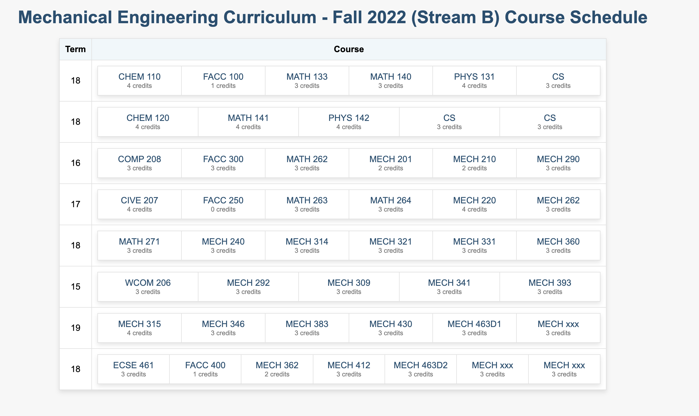

# Curriculum Parser

This is a Python application that extracts and parses course information from a curriculum table in a Word document. It provides a web interface to view the course schedule and highlights prerequisites and corequisites when hovering over a course.

## Features

- Extracts course information from a Word document's curriculum table.
- Provides a web interface to visualize the course schedule.
- Highlights prerequisites and corequisites when hovering over a course.
- Utilizes Flask for the web application.



## Prerequisites

- Python 3.6 or higher
- Flask (`pip install Flask`)
- python-docx (`pip install python-docx`)

## Usage

1. Clone this repository:
   ```
   git clone https://github.com/luaiabuelsamen/course_planner.git
   cd curriculum-parser
   ```

2. Install the required packages:
   ```
   pip install -r requirements.txt
   ```

3. Run the application:
   ```
   python app.py path_to_curriculum.docx
   ```

4. Open your web browser and go to `http://localhost:5000` to view the course schedule.

## Project Structure

- `app.py`: Main application script that sets up the Flask web application.
- `consume_curriculum.py`: Contains functions to extract and parse course data from the Word document.
- `templates/index.html`: HTML template for the web interface.
- `static/style.css`: CSS styling for the web interface.

## Contributing

Contributions are welcome! Feel free to fork the repository and submit pull requests.

## License

This project is licensed under the MIT License - see the [LICENSE](LICENSE) file for details.